##iOSGank

Gank.io iOS 客户端

其实原来就打算以学习swift来写点小东西,写着写着就跑偏了,直接撸个客户端吧. 在此感谢大神 @代码家 的大力support.

####先说下实现的功能吧, 这样大家好快速定位到Code
#####Alamofire发送请求并解析JSON 
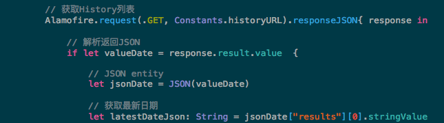
#####加载中
1. NVActivityIndicator

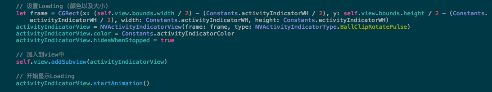
2. HUD

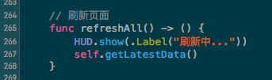

######友盟相关 (分享, 统计, 推送)
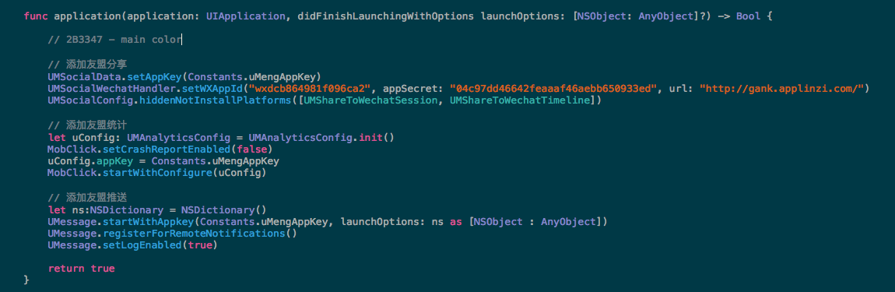
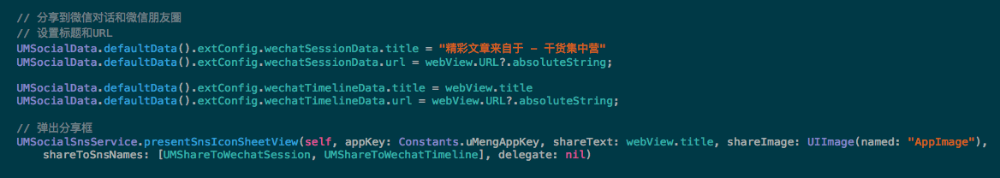
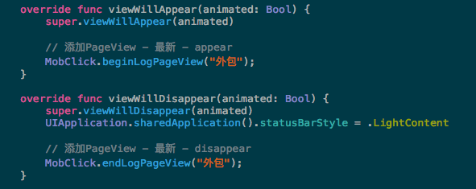

######搜索
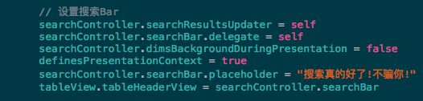
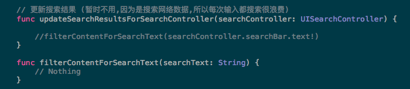
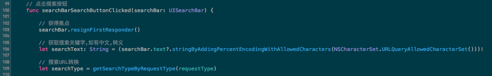

#####Web View && Progress Bar

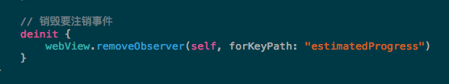

#####福利页面Layout (转盘显示福利)
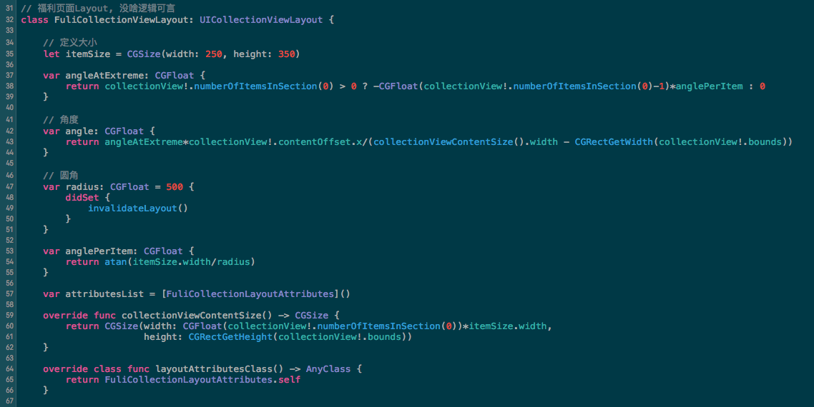

##### 解析HTML
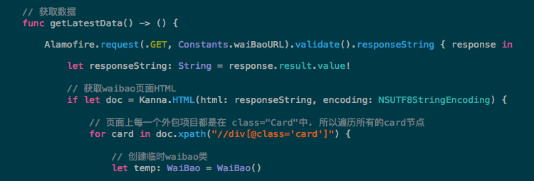

##### 照片浏览
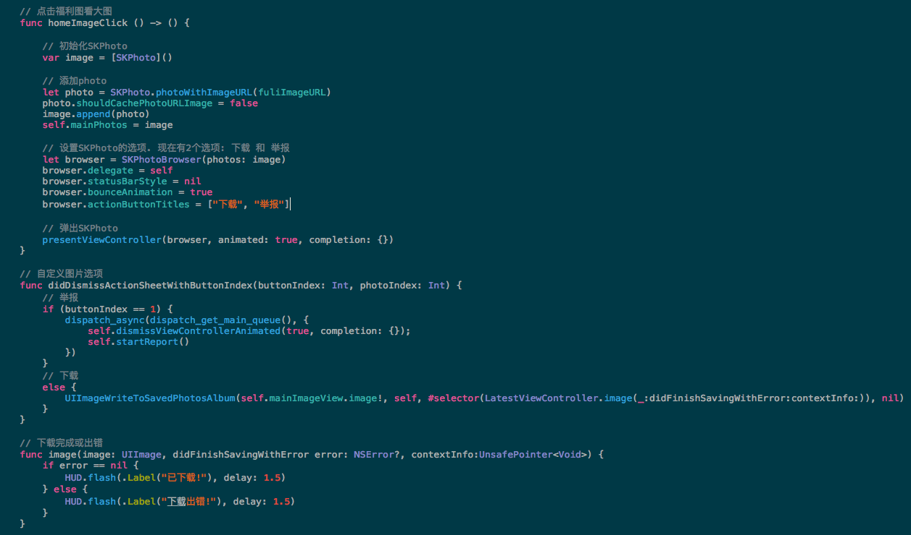

##### 计算时间差
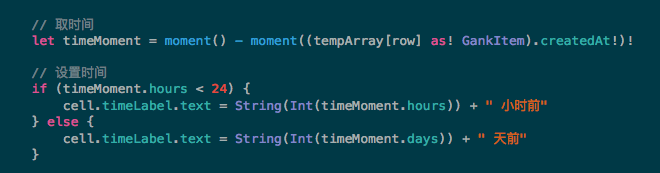

####集成依赖

就说下几个比较主要的吧:
######网络部分:
1. Alamofire & AlamofireImage (网络请求以及图片加载)

######Loading:
1. PKHUD (HUD for swift)
2. NVActivityIndicatorView

######解析:
1. SwiftyJSON (解析Json)
2. Kanna (解析html)

######特效:
1. RAMAnimatedTabBarController (TabBar特效)
2. LTMorphingLabel (Label特效)
 
######Tools:
1. SwiftHEXColors (String HEX for UIColor)
2. SKPhotoBrowser (图片浏览)
3. SwiftMoment (计算时间差)

######第三方:
1. UMengSocialCOM (友盟分享)
2. UMengAnalytics-NO-IDFA (友盟分析)
3. UMengMessage (友盟推送)

#### 整体架构
共三部分,对应着Tabbar的三个Controller

1. 最近一天的信息
2. 分类浏览 (+搜索)
3. 外包信息

#### GankItem & Daily
根据Gank.io的API的返回,可以大致总结出2个实体类

Daily为定义每一天的总体数据
	 
	private var _category: NSArray = []
    private var _results: Array<GankItem> = []
    
    var category: NSArray {
        get{
            return _category
        }
        set {
            _category = newValue
        }
    }
    var results: Array<GankItem> {
        get{
            return _results
        }
        set {
            _results = newValue
        }
    }

GankItem为每一条的具体内容
    
    private var _id: String? = ""
    private var _createdAt: String? = ""
    private var _desc: String? = ""
    private var _publishedAt: String? = ""
    private var _source: String? = ""
    private var _type: String? = ""
    private var _url: String? = ""
    private var _who: String? = ""
    private var _readability: String? = ""
    
    var id: String? {
        get{
            return _id
        }
        set{
            _id = newValue
        }
    }
    var createdAt: String? {
        get{
            return _createdAt
        }
        set{
            _createdAt = newValue
        }
    }
    ......
    ......

数据结构就这2种,其他的就是显示UI了,大家可以down下源码看看,注释写的不算少,一看就懂!

来张项目图吧:
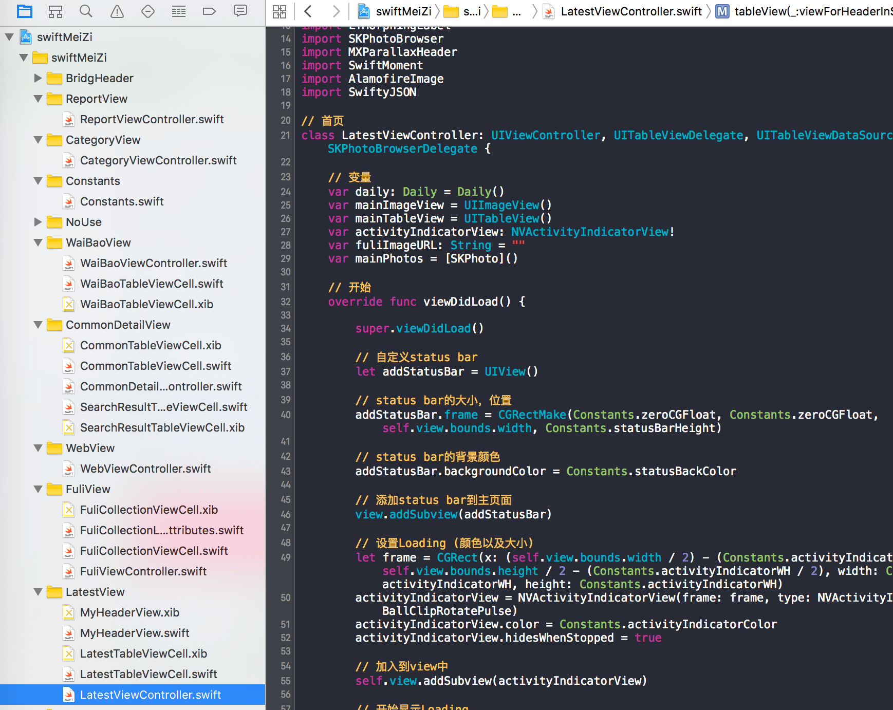

